Master 

Develop 

32 requirements of 32 have been implemented, which is 100%.

| ID | Name                                                                                                                                                                                        | Met  | Screenshot                                                                                                           |
|----|---------------------------------------------------------------------------------------------------------------------------------------------------------------------------------------------|------|----------------------------------------------------------------------------------------------------------------------|
| 1  | All the capital cities in the world organised by largest population to smallest.                                                                                                            | Yes  | 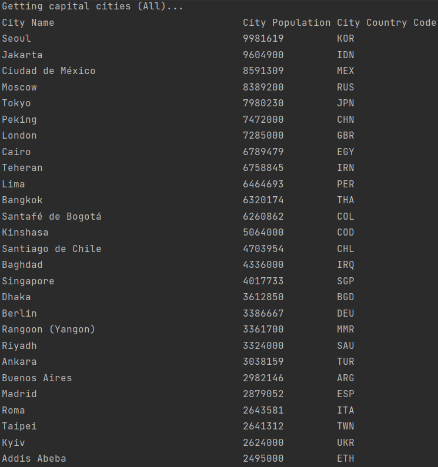                                                                |
| 2  | All the capital cities in a continent organised by largest population to smallest.                                                                                                          | Yes | 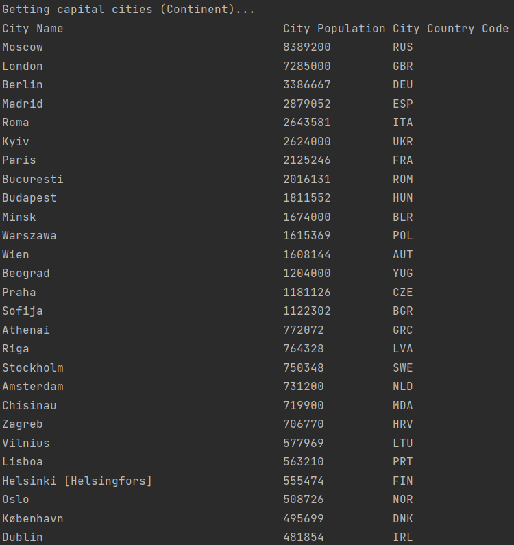                                                     |
| 3  | All the capital cities in a region organised by largest to smallest.                                                                                                                        | Yes |                                                |
| 4  | The top N populated capital cities in the world where N is provided by the user.                                                                                                            | Yes | 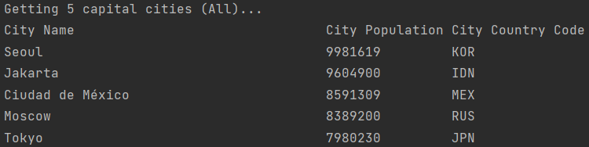                                                              |
| 5  | The top N populated capital cities in a continent where N is provided by the user.                                                                                                          | Yes | 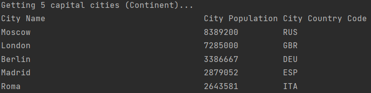                                                   |
| 6  | The top N populated capital cities in a region where N is provided by the user.                                                                                                             | Yes | 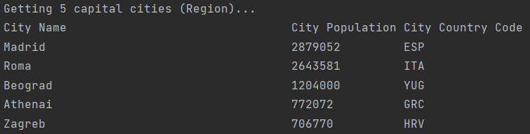                                             |
| 7  | All the countries in the world organised by largest population to smallest.                                                                                                                 | Yes | 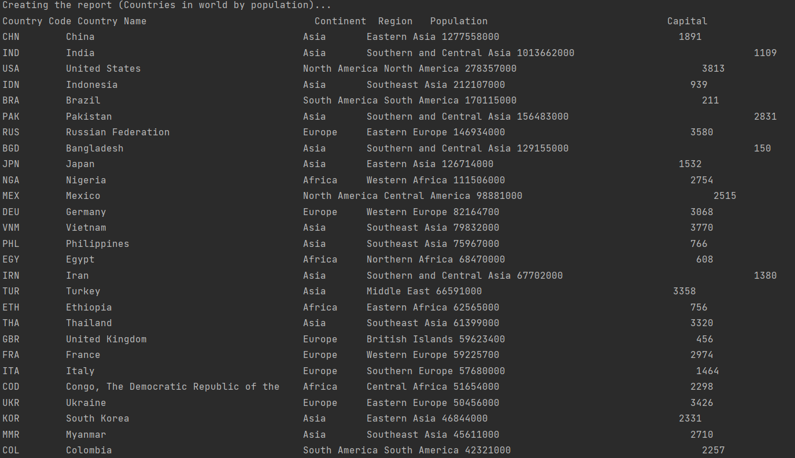                                                                 |
| 8  | All the countries in a continent organised by largest population to smallest.                                                                                                               | Yes | 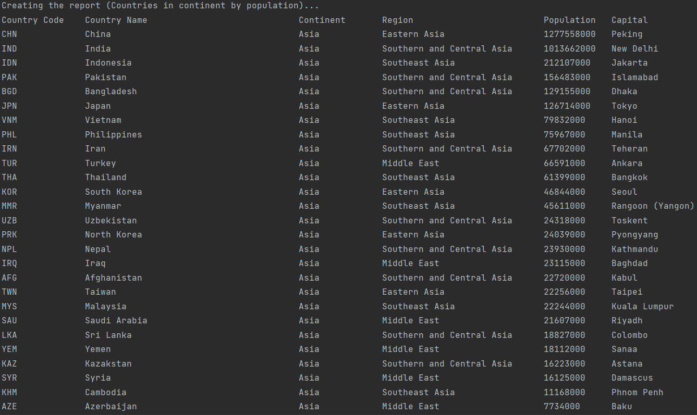                                                        |
| 9  | All the countries in a region organised by largest population to smallest.                                                                                                                  | Yes | 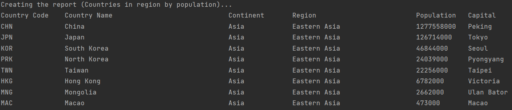                                                   |
| 10 | The top N populated countries in the world where N is provided by the user.                                                                                                                 | Yes | 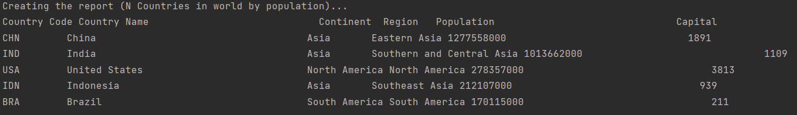                                                               |
| 11 | The top N populated countries in a continent where N is provided by the user.                                                                                                               | Yes | 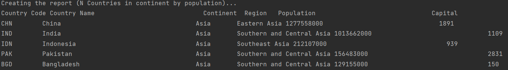                                                      |
| 12 | The top N populated countries in a region where N is provided by the user.                                                                                                                  | Yes | 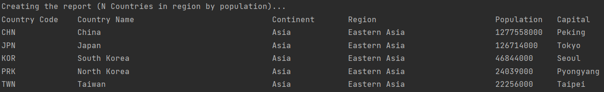                                                 |
| 13 | All the cities in the world organised by largest population to smallest.                                                                                                                    | Yes | 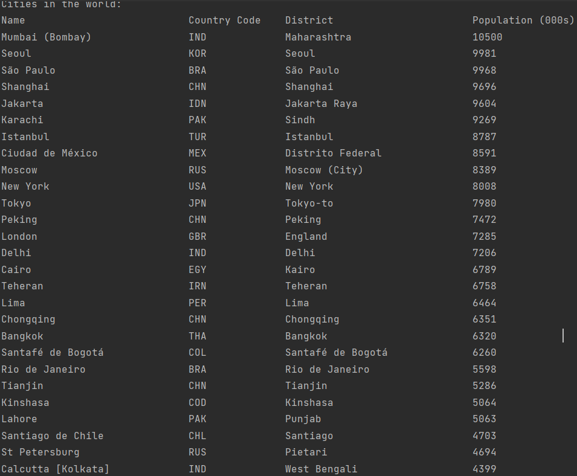                                                                  |
| 14 | All the cities in a continent organised by largest population to smallest.                                                                                                                  | Yes | 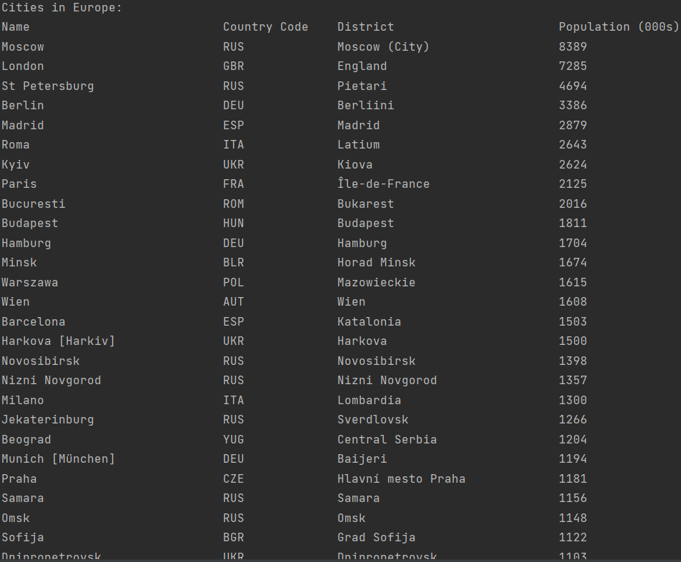                                                       |
| 15 | All the cities in a region organised by largest population to smallest.                                                                                                                     | Yes | 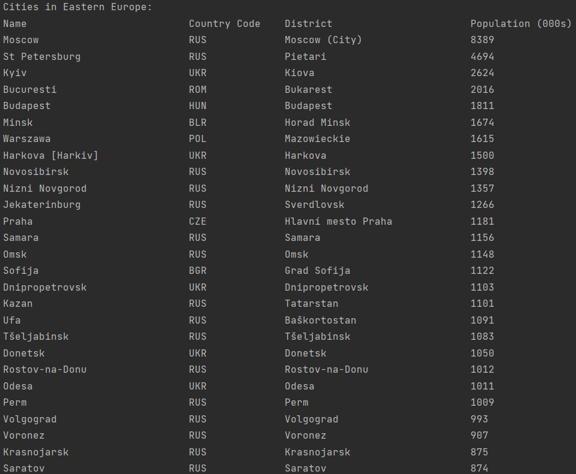                                                  |
| 16 | All the cities in a country organised by largest population to smallest.                                                                                                                    | Yes | 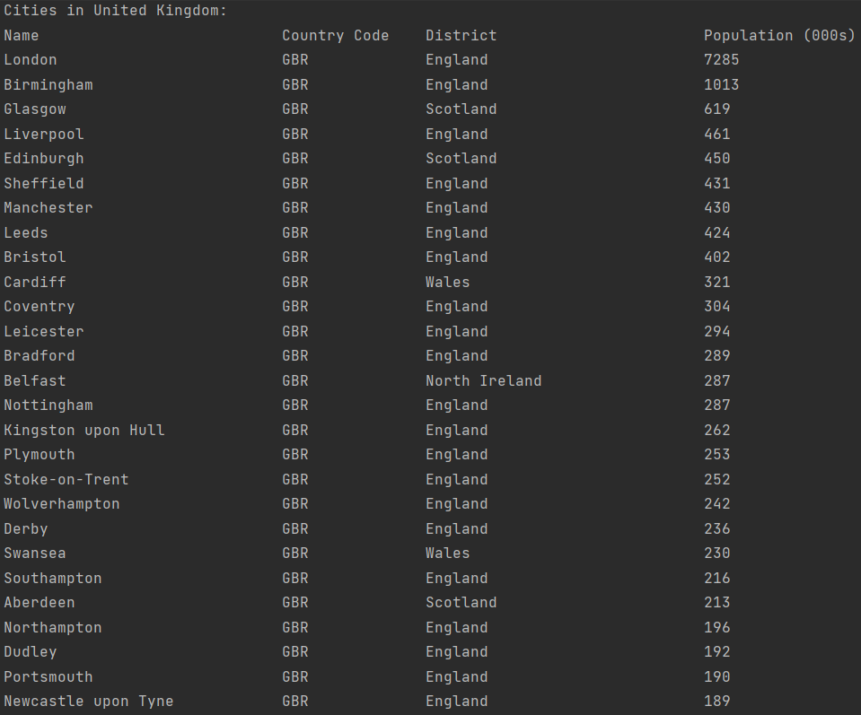                                                 |
| 17 | All the cities in a district organised by largest population to smallest.                                                                                                                   | Yes | 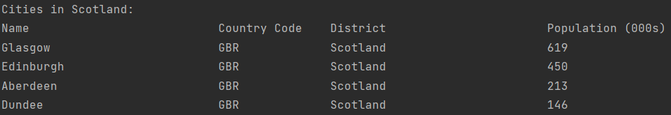                                                      |
| 18 | The top N populated cities in the world where N is provided by the user.                                                                                                                    | Yes | 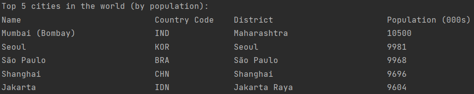                                                                |
| 19 | The top N populated cities in a continent where N is provided by the user.                                                                                                                  | Yes | 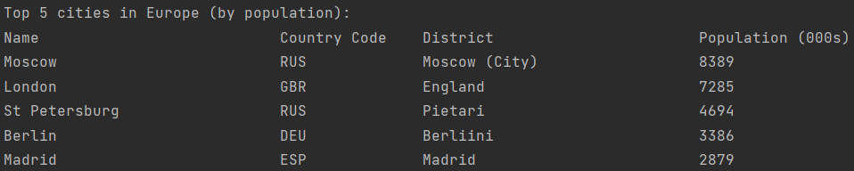                                                     |
| 20 | The top N populated cities in a region where N is provided by the user.                                                                                                                     | Yes |                                                 |
| 21 | The top N populated cities in a country where N is provided by the user.                                                                                                                    | Yes | 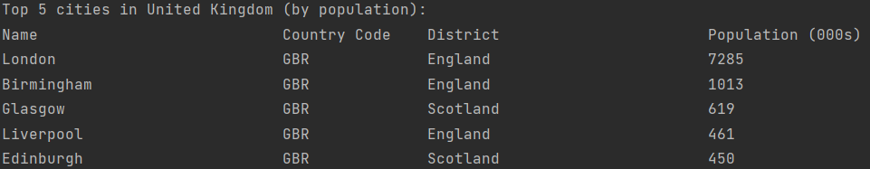                                               |
| 22 | The top N populated cities in a district where N is provided by the user.                                                                                                                   | Yes | 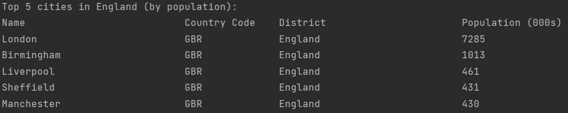                                                    |
| 23 | Provide the number of people who speak the following languages from greatest number to smallest, including the percentage of the world population: Chinese, English, Hindi, Spanish, Arabic | Yes | 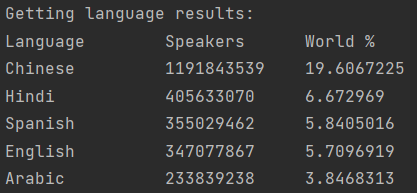                                                            |
| 24 | The population of people, people living in cities, and people not living in cities in each continent. | Yes | 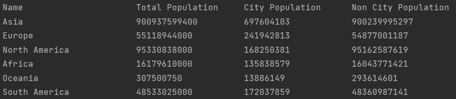                                                         |
| 25 | The population of people, people living in cities, and people not living in cities in each region. | Yes | 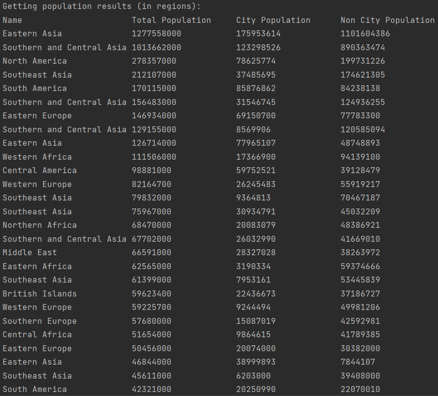                                                   |
| 26 | The population of people, people living in cities, and people not living in cities in each country. | Yes | 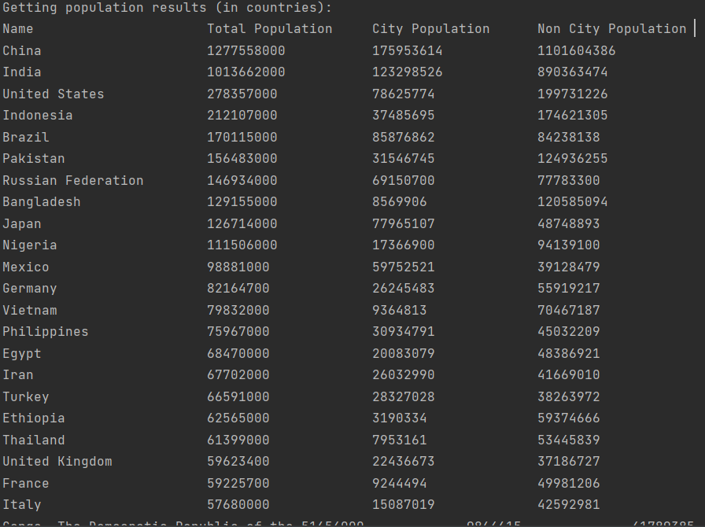                                                          |
| 27 | The population of the world. | Yes | 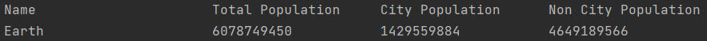                                                              |
| 28 | The population of a continent. | Yes | 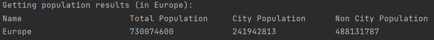                                             |
| 29 | The population of a region. | Yes | 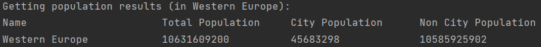  |
| 30 | The population of a district. | Yes | 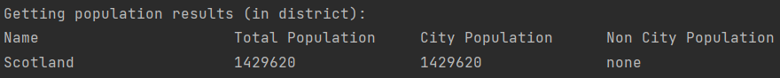                                                  |
| 31 | The population of a country. | Yes | 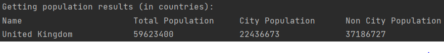                                                            |
| 32 | The population of a city. | Yes | 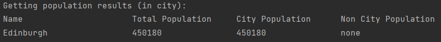                                                                                                  |
